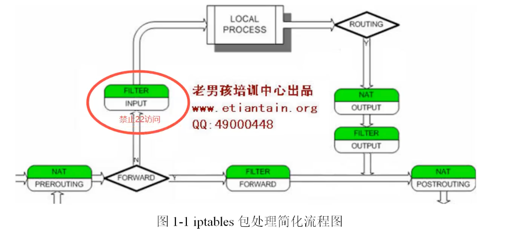

# Iptables

## Description

**iptables**用于设置、维护和检查 Linux 内核中的 IP 包过滤规则表。可以定义几个不同的表。每个表包含许多内置链，也可能包含用户定义的链。

每个链是一个规则列表，可以匹配一组数据包。每个规则都指定如何处理匹配的数据包。这称为target，它可能是到同一个表中用户定义的链的跳转。

## Target

一条防火墙规则定义了个标准为packet和target。如果packet没匹配上规则，就在下一条chain上检查。如果匹配则下个规则由目标值指定，该值可以是user-defined chain 或特殊的值*ACCEPT*, *DROP*, *QUEUE*, or *RETURN*

- ACCEPT：让数据包通过
- DROP：丢弃数据包
- REJECT：拒绝
- SNAT：源地址转换
- DNAT：目的地之转换
- MASQUERADE：动态修改Source Socket（无法指定IP，取当时网卡IP），较方便效率较差
- RETURN：结束自行定义的Chain然后返回原来的Chain继续跑规则
- MARK：标记package，会继续比对其他规则

## Tables

现在有五张互相独立的表（哪些表开启具体由内核配置决定）

-t，--table	 命令行参数指定某张表

以下是所有表

- filter：这是一张默认的表（如果不指定-t选型），它内置chain：INPUT、FORWARD、OUTPUT

  - INPUT：发往local socket的packets
  - FORWARD：路由之后的packets
  - OUTPUT：本地生成后需要发送的packets

- nat：遇到创建新连接的packets时会查询此表，它内置chain：PREROUTING、OUTPUT、POSTROUTING

  - PREROUTING：更改刚进入的packets
  - OUTPUT：更改在路由之前的packets
  - POSTROUTING：更改将要发出去的packets

- mangle：用于特殊的数据包改造

  内核版本2.4.18以前

  - PREROUTING
  - OUTPUT

  内核版本2.4.18之后，加入另外三种链

  - INPUT
  - FORWARD
  - PREROUTING

- raw：用于豁免配置NOTRACK 的targt，有着更高的优先级，在其他IP tables之前

  - PREROUTING
  - OUTPUT

## Usage

### Commands

- -A chain # 添加规则到链
- -D chain # 删除规则从链里
- -D chain rulenum # 根据规则号删除
- -I chain [rulenum] # 插入规则默认到第一条
- -L [chain [rulenum]] # 列表规则
- -F [chain] # 清空所有规则
- -Z  [chain [rulenum]] # 计数器
- -P chain target # 改默认规则

### Options

- -p proto # 针对协议过滤，例如tcp
-  -s address [/mask] 基于源地址
- -d address[/mask] 基于目的地址
- -i input name[+] 指定进入接口
- -j target 跳转
- -n 数字输出地址和端口
- -o output name[+] 指定出去接口
- -t table 指定表
- --line-numbers 显示规则号
- --dport 对目的端口
- --sport 对源端口
- -m multiport 多端口

### example

封端口：iptables -A INPUT -p tcp --dport 22 -j DROP

禁止源ip10.0.0.1访问：iptables -I INPUT -s 10.0.0.1 -i eth0 -j DROP

封多端口：

- iptables -I INPUT -p tcp -m multiport --dport 22,80 -j DROP
- iptables -I INPUT -p tcp --dport 22:80 -j DROP

匹配ICMP类型

- iptables -A INPUT -p icmp --icmp-type 8 -j DROP

- iptables -A INPUT -p icmp -m icmp --icmp-type any -j ACCEPT

让10.0.0.7和10.0.0.1服务器可以Ping，其它的不能Ping

- iptables -I INPUT -p icmp --icmp-type 8 -s 10.0.0.7 -j ACCEPT

- iptables -I INPUT -p icmp --icmp-type 8 ! -s 10.0.0.1 -j REJECT

  ​	

