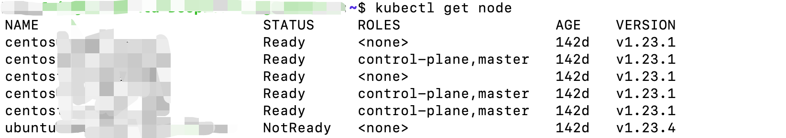
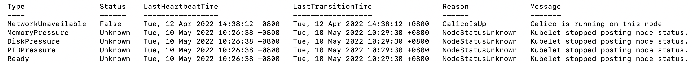
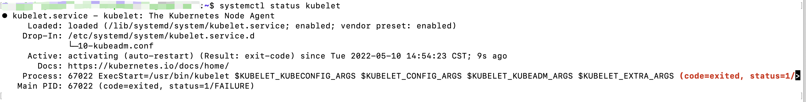
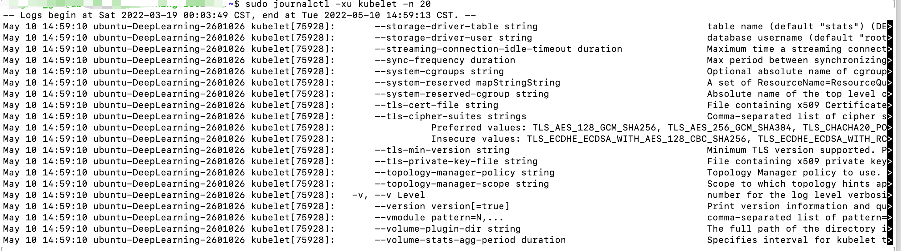
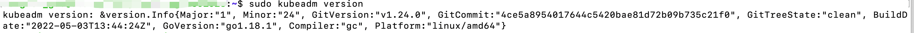
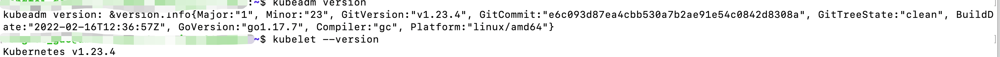
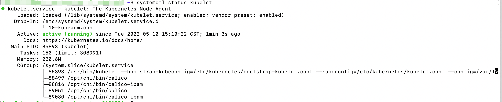
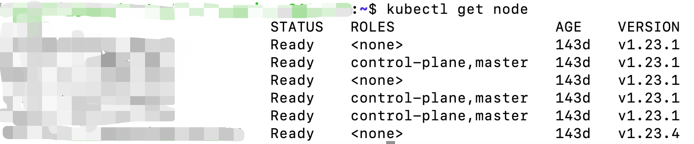

# Ubuntu 20.04.4 LTS 自动升级kubelet版本导致node不可用

## 现象

在一个风和日丽的早上，kubectl get node 发现其中一个node Not Ready。



运行在该node上面的pod全部处于Terminating的状态，describe node查看到以下event信息



## 排查

#### 查看kubelet的状态

上面信息说，kubelet停止了报告node的状态信息，第一想到的是看下kubelet有没有正常运行

```bash
$ systemctl status kubelet
```

发现kubelet的状态处于退出状态



#### 查看kubelet日志

```bash
$ sudo journalctl -xu kubelet -n 20
```

日志显示有点像启动kubelet时的参数不正确



#### 查看kubelet 版本

当时这里查看的是kubeadm的版本，kubelet版本怎么查看忘记了（`kubelet --version`），然后因为kubeadm和kubelet是同时安装的所以kubeadm的版本也可以当做参考

```bash
$ kubeadm version
```

这里显示的是1.24了，而上面node的版本是1.23.4，所以断定是kubelet的版本升级了，而导致启动时的args不兼容，启动失败，有可能1.24版本遗弃了一些参数



## 解决方法

#### 降级kubelet版本

1. 安装低版本kubelet和kubeadm

```bash
$ sudo apt-get install kubeadm=1.23.4-00 kubelet=1.23.4-00
```

2. 查看安装完的版本



3. 取消kubelet和kubeadm包自动更新

```bash
$ sudo apt-mark hold kubeadm kubelet
```

4. 查看kubelet运行状态

```bash
$ systemctl status kubelet
```



5. 查看node运行状态

```bash
$ kubectl get node
```



到这里问题解决了，Node 重新起来了，pod也都正常了

## 结论

在ubuntu上安装kubernetes时，需要apt-mark hold 安装的版本，不然包自动更新时，会升级该组件的版本而导致节点出问题（其实在官方安装说明中，也列出了有这一步，有可能是安装人员粗心导致）

这里想了下为什么ubuntu需要自动更新包，能不能直接禁止ubuntu的包更新，而一劳永逸的解决这个问题，而不是手动去hold该包的更新。

这里简单的搜了下：定期更新Ubuntu系统是整体系统安全性的最重要方面之一。如果您不使用最新的安全补丁更新操作系统的软件包，那么您的计算机容易受到攻击。

好的说的有道理，还是勤快点hold住包的更新吧

### 未完待续

这里还有一个不清楚的点，为什么kubelet自动更新到1.24之后不能正常运行，apt-get 不会更新kubelet.service中的启动参数吗？而沿用的是旧的config配置。


