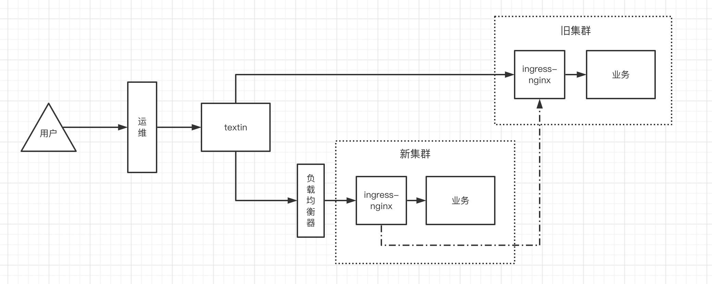

# default backend

## 业务背景

自从上次混合云的大集群发生故障，而导致服务大批量的不可用，持续时间很长。吃了这次苦头之后，需要避免下次再次发生，采取的措施主要是将一个大集群切割成两个小集群而实现互备。有以下优势：

1. 当其中一个集群发生故障时，影响范围缩小
2. 集群升级某些重要组件时，而导致服务不可用，可以集群间相互切换而达到不停机更新
3. 单机房服务器数量有限，无法在单机房扩容节点
4. 异地机房网络节点间网络联通问题，不如各自建集群

## 架构

下图是调用链路的架构图

1. 未上新集群时，直接由textin 调旧集群服务。
2. 上了新集群之后，由textin分原来部分流量到新集群，由于新集群并没有上线所有服务，所以没有的服务需要代理到旧集群，也就是下图中新集群ingress-nginx 到旧集群ingress-nginx的虚线。新集群中已经存在的服务，则直接调取业务pod返回。

## 问题

新集群配置完之后，textin切入1/10的流量到新集群，textin的监控发现demoire服务（该服务不在新集群中）会时不时出现404和413的情况，别的服务未发现异常。而正常部署在新集群的服务没有异常，所以问题可能是新集群创建的default backend（新集群到旧集群的虚线）。

## 排查

单独查看新集群的ingress nginx 未发现404和413的access log，问题就比较难定位，如果是default backend的bug那就直接导致这个方案将不可用，不能将旧集群当做新集群的备机，后续服务迁移就会带来很大的不便。

### 复现问题

1. 拿到请求失败的图片和请求路径进行复现，单独请求LB（load balance）不能复现（怀疑只有在并发的情况下可能出现）
2. 使用ab对LB压测，不能复现（怀疑是LB的问题，这里LB因为某些原因只能用七层代理，也就有可能因为配置不当而产生404、413）
3. 问运维查看LB的日志，运维没有办法看到日志需要找云厂商过程比较麻烦，而且没有足够证据提供。
4. 验证是否是LB的问题，让textin直接访问ingress服务器地址，跳过LB，问题重现，排除LB的问题
5. 查阅资料发现有搭边的issue，配置default backend时，出现了一些异常状态码，怀疑是ingress nginx版本问题
6. 升级ingress nginx版本，问题仍然复现

以上全部的问题复现都是在textin的正式环境中进行，因为不知道怎么手动复现这个问题，上面也都是对新集群的怀疑，这里主要是有一个先入为主的概念，textin和旧集群服务之间的访问一直是正常的，所以就觉得他们都是正确的，而新集群就是很大的怀疑对象

使用textin测试环境访问新集群

1. 使用curl 访问textin测试环境demoire服务，发现问题，每次访问都是404，在textin服务器上单独curl 新集群地址是正常的
2. 怀疑nginx配置问题，使用其他openresty服务使用该配置，也是正常的
3. 服务层发现不了问题，只能通过抓包查看，先从http层面开始。通过nc 抓取到textin测试环境到ingress地址的请求参数。
4. 拿到完整的请求参数请求，复现问题，一步步减少请求参数，最终定位到和http header中的`X-Forwarded-Host`有关

到这里问题可以复现了，接下来就剩分析和解决问题了

## 分析问题

### header：X-Forwarded-Host 是什么？又为什么会在textin的请求头中？

答：X-Forwarded-Host用于确定最初使用哪个主机，也就是标识该请求是从哪个host请求过来的。从上面的架构图中，可以看出textin服务器前面还有一层运维的代理。用户访问`https://ocr-api-sandbox.ccint.com`域名解析到运维的服务器，运维在将流量代理到textin，而textin使用的是openresty的proxy_pass，在转发的过程中默认会继承代理过来的header到后端

### X-Forwarder-Host为什么会引发404？

答：下图是新集群到旧集群的一个http抓包，可以看到代理到旧集群时，host改为之前的X-Forwarder-Host的值。这也将直接导致请求到旧集群时，没有这个host而返回404。

### 线上环境出现问题时为什么有时404有时413，而不是一直是404？

答：旧集群没有配置所有接口都不限制请求体大小，而默认的nginx体积为8k。代理到旧集群的请求，若用户发送的请求体大于8k则返回413，否则返回404

### 为什么只有demoire服务出现异常？

答：线上切流量时只切了1/10，而且观察的时候，是业务谷峰只有不在新集群里的请求量大的服务才可能出现。而且观察的时间比较短，就产生了一个错觉只有demoire服务有这个问题

## 解决问题

1. textin转发时去除所有和代理相关的头部，因为这些头部是代理透传过来的而不是符合实际含义的
2. 配置annotation：`nginx.ingress.kubernetes.io/upstream-vhost: $host`

注：upstream-vhost 等价于 proxy_set_header，就是将代理转发的host设置为当前的host，将会覆盖默认行为X-Forwarder-Host 设为host

## 过程反思

1. 当只有正式环境可以复现问题时，怎么将流量复制一份到测试环境进行复现问题?
2. 

## 疑难杂症

下面的问题是还没有找到合适的解答

1. ingress nginx将X-Forwarder-Host的值转换为下一跳的host的行为是合理的吗？
2. openresty proxy_pass设置不透传请求头的配置

