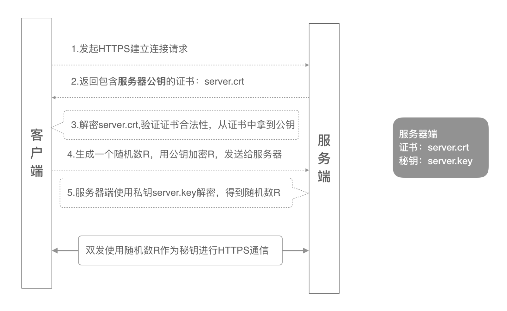
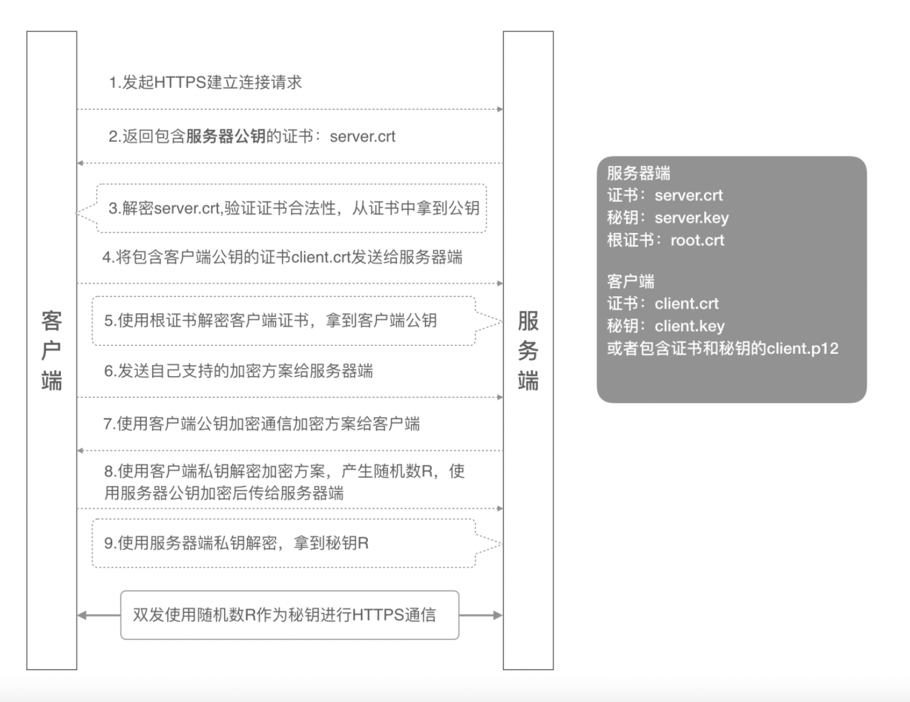

## 单向认证流程

## 双向认证流程

## ca证书签名流程

1. CA机构使用hash算法对客户提交的资料（此资料为名称、组织、国家、公钥等）进行加密后，生成一段HASH值，即摘要（因为明文很长，非对称加密耗时，所以将加密信息改成摘要）
2. CA机构用自己的私钥将生成的摘要进行加密，生成加密后的密文
3. CA机构将生成的密文、客户提交的公钥、客户提交的信息，签名生成一个数字证书，交给客户

## 浏览器验签流程

1. 浏览器拿到CA机构发的数字证书后，进行拆解，拆解为：客户提交的资料、CA机构私钥加密后的密文、客户的公钥
2. 浏览器用CA机构声明的HASH算法，对拆解出来的资料进行运算，得到一个HASH值，即摘要
3. 浏览器使用CA机构的公钥（PKI体系会对外公布CA的公钥）对拆解出来的密文进行解密，得出摘要
4. 若第2步的出来的HASH值与第3步解密出来的值相等，则证明CA机构的身份验证是没有问题的

