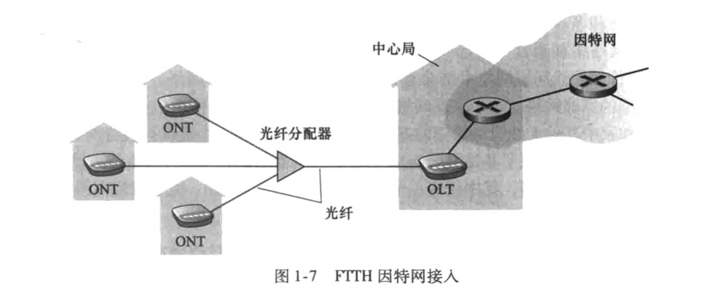
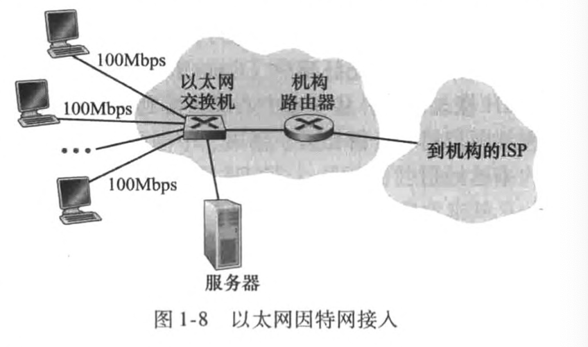
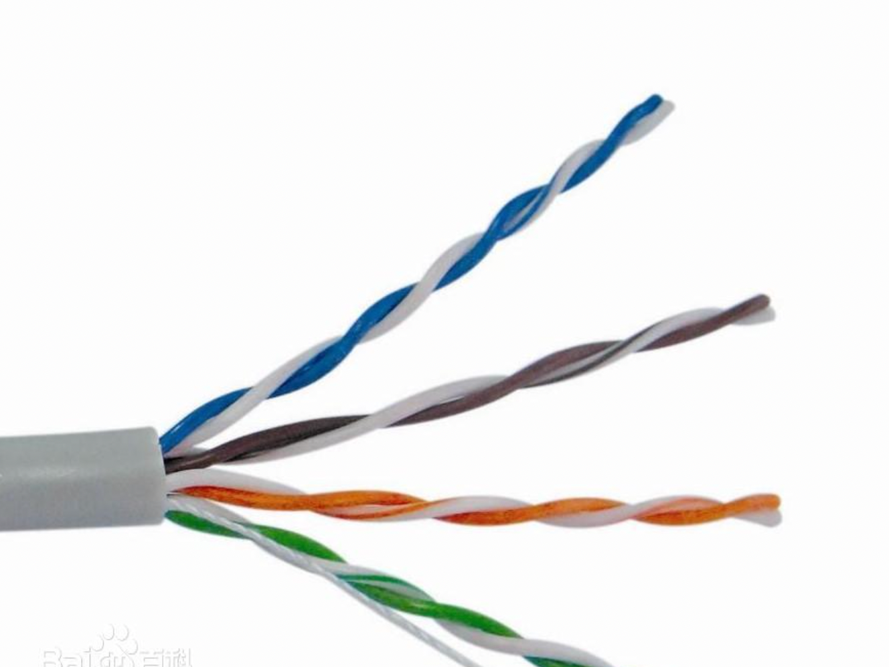
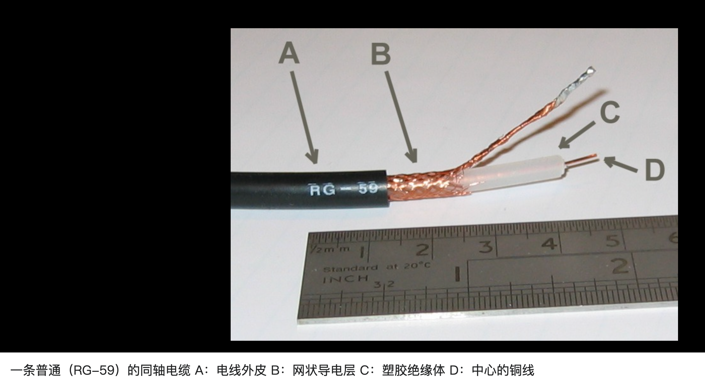
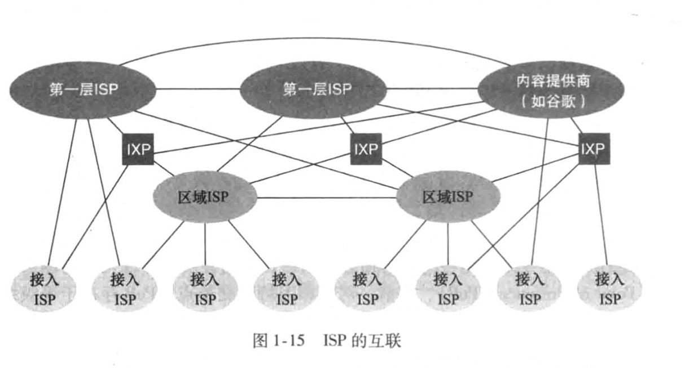
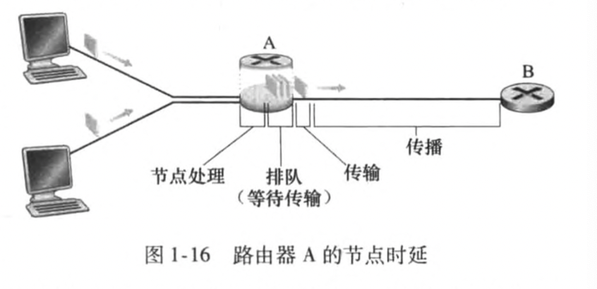
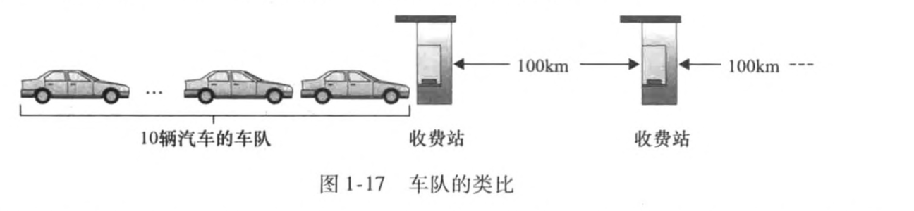
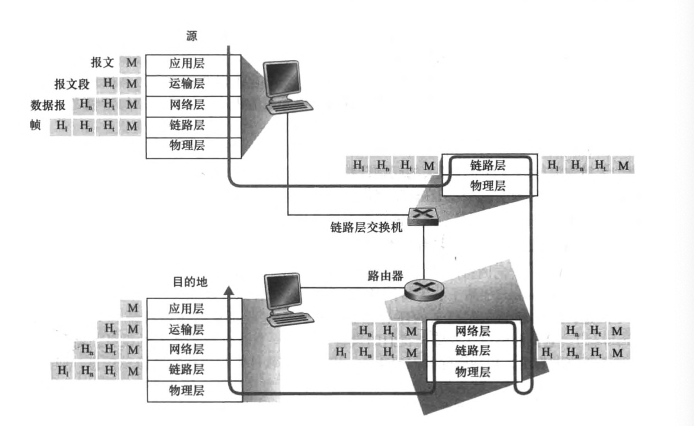

## 计算机网络和因特网

### 什么是因特网

1. 描述因特网的具体构成，即构成因特网的基本硬件和软件组件
2. 能够根据为分布式应用提供服务的联网基础设施来描述

#### 具体构成描述

所有连入因特网的设备称为主机或端系统。端系统通过通信链路和分组交换机连接到一起。

通信链路由不同的物理媒体组成，包括同轴电缆、铜线、光纤和无线电频谱。分组交换机从它的一条入通信链路接收到达的分组，并从它的一条出通信链路转发该分组，最著名的类型是路由器和链路层交换机。一个分组所经历的一些列通信链路和分组交换机称为通过该网络的路径

端系统通过因特网服务提供商（ISP）接入因特网，

#### 服务描述

应用程序涉及多个相互交换数据的端系统，故它们称为分布式应用程序。研发的一种分布式因特网应用程序，运行在不同端系统上的软件将需要互相发送数据，通过套接字接口（发送程序需要遵循的规则集合）。

#### 什么是协议

1. 举例人类活动：问候你好。上课回答问题举手等
2. 定义在两个或多个通信实体之间交换的报文的格式和顺序，以及报文发送和接收所采取的动作

#### 网络边缘

端系统：与因特网相连的计算机和其他设备（client、server）

#### 接入网

边缘路由器：端系统到任何其他远程端系统的路径上的第一台路由器

##### 家庭接入：DSL、电缆、FTTH、拨号和卫星

- 数字用户线（Digital Subscriber Line）：本地电话公司是它的ISP，DSL调制解调器使用现有的电话线（双绞线）与位于电话公司的本地中心局中的数字用户线接入复用器DSLAM交换数据

家庭电话线通过不同频率来编码区分电话还是上网。

- 电缆因特网（共享广播媒体）接入需要特殊的调制解调器

- 光纤到户（Fiber To The Home）：从本地中心局直接到家庭提供了一条光纤路径

  - 直接光纤：从本地中心局到每户设置一根光纤

  - 从中心局出来的每根光纤实际由许多家庭共享，直到相对接近这些家庭的位置，才分成每户一根光纤

    - 主动光纤网络（Active Optical Network）本质是交换因特网

    - 被动光纤网络（Passive Optical Network）

      家庭路由器->ONT->光纤分配器->OLT，FTTH可以提供每秒千兆比特的接入速率，但大多数FTTH ISP提供多种不同速率选择

      

- 卫星链路：在无法使用DSL、电缆和FTTH的地方，使用卫星链路将住宅以超过1Mbps的速率接入因特网。

##### 企业（和家庭）接入：以太网和WiFi

1. 以太网：以太网用户使用双绞铜线与一台以太网交换机相连，以太网交换机或这样相连的交换机网络与更大的因特网相连，用户通常以100Mbps或1Gbps速率接入以太网交换机

   

   2. WiFi：通过无线接入因特网

   ##### 广域无线接入：3G和LTE

   通过蜂窝网提供商运营的基站来发送和接收分组，与WiFi不同的是，一个用户仅需要位于基站的数万米，3G超过1Mbps速率，4G超过10Mbps速率

#### 物理媒体

1. HFC使用光缆和同轴电缆相结合的技术
2. DSL和以太网使用双绞铜线
3. 移动接入网使用无线电频谱

物理媒体分成两种类型

1. 导引型媒体—电波沿着固体媒体前行，如光缆、双绞铜线或同轴电缆
2. 非导引型媒体—电波在空气或外层空间中传播，如无线局域网或数字卫星频道

##### 双绞铜线

1. 最便宜且最常用的导引型传输媒体
2. 常用于局域网，速率从10Mbps到10Gbps，所能达到的数据传输速率取决于线的粗细以及传输方和接收方之间的距离

##### 同轴电缆

1. 数据传输速率较高
2. 适用于电缆电视和电缆因特网接入，发送设备将数字信号调制到某个特定的频段，产生的模拟信号从发送设备传送到一个或多个接收方。
3. 被用作导引型共享媒体

##### 光纤

一种细而柔软的、能够导引光脉冲的媒体，每个脉冲表示一个比特

1. 支持极高的比特速率，高达数十甚至数百Gbps
2. 不受电磁干扰，长达100km的光缆信号衰减极低，并且很难窃听

成为长途导引型传输媒体，特别是跨海链路

##### 陆地无线电信道

无线电信道承载电磁频谱中的信号

1. 不需要安装物理线路
2. 具有穿透墙壁、提供与移动用户的连接以及长距离承载次你好能力
3. 吸引力的媒体
4. 依赖传播环境和信号传输距离。环境上的考虑取决于路径损耗和遮挡衰落

划分为三类

1. 很短距离（个人设备头戴耳机）
2. 局域（无线LAn）
3. 广域（蜂窝接入技术）

##### 卫星无线电信道

一颗通信卫星连接地球上的两个或多个微波发射器，被称为地面站。该卫星在一个频段上接收传输，使用一个转发器再生信号，并在另一个频率上发射信号。

1. 同步卫星：永久地停留在地球上方的相同点上。这种静止性通过将卫星置于地球表面上方36000km的轨道上取得
2. 近地轨道卫星放置得非常靠近地球，并且不是永久地停留在地球上方的一个点。为了提供对一个区域的连续覆盖，需要在轨道上放置许多卫星

### 网络核心

#### 分组交换

分组：源将长报文划分为较小的数据块，分组以等于链路最大传输速率的速度传输通过通信链路

交换机主要有两类：路由器和链路层交换机

##### 存储转发传输

存储转发传输指在交换机能够开始向输出链路传输该分组的第一个比特之前，必须收到整个分组

d端到端 = N （L/R）

注：N条速率为R的链路组成的路径

##### 排队时延和分组丢失

输出缓存：每台分组交换机有多条链路与之相连，该分组交换机具有一个输出缓存，用于存储路由器准备发往那条链路的分组

排队时延：如果到达的分组需要传输到某条链路，但发现该链路正忙于传输其他分组，该到达分组必须在输出缓存中等待，除了存储转发时延以外，分组还要承受输出缓存的排队时延

丢包：因为缓存空间的大小是有限的，一个到达的分组可能发现该缓存已被其他等待传输的分组完全充满了，到达的分组或已经排队的分组之一将被丢弃

##### 转发表和路由选择协议

转发表：每个端系统具有一个称为IP地址的地址，当一个分组到达网络中的路由器时，路由器检查该分组的目的地址的一部分，并向一台相邻路由器转发该分组。每台路由器具有一个转发表

路由选择协议：用于自动设置转发表，一个路由选择而协议可以决定从每台路由器到每个目的地的最短路径，并使用这些最短路径结果来配置路由器中的转发表

#### 电路交换

通过网络链路和交换机移动数据有两种基本方法：电路交换和分组交换

在电路交换网络中，在端系统间通信会话期间，预留了端系统间沿路径通信所需要的 资源(缓存，链路传输速率)。

##### 电路交换网络中的复用

频分复用（Frequency- Division Multiplexing, FDM），链路的频谱由跨越链路创建的所有连接共享。在连接期间链路为每条连接专用一个频段。

时分复用（(Time-Division Multiplexing, TDM)），时间被划分为固定期间的帧，并且每个帧又被划分为固定数量的间隙。当网络跨越一条链路创建一条连接时，网络在每个帧中为该连接指定一个时隙。

题：

1. 从主机A到主机B经一个电路交换网络发送一个640 000比特的文件需要多长 时间。假如在该网络中所有链路使用具有24时隙的TDM，比特速率为1.536Mbps。同时假定在主机A能够开始传输该文件之前，需要500ms创建一条端到端电路。它需要多长时间才能发送该文件?
2. 每条链路具有的传输速率是1.536Mbps/24 = 64kbps,因此传 输该文件需要(640kb)/(64kbps) =10so这个10s,再加上电路创建时间，这样就需要 10. 5s发送该文件。

#### 网络的网络

因特网交换点(Internet Exchange Point, IXP) , IXP是一个汇合点，多个ISP 能够在这里一起对等

#### 分组交换网中的时延、丢包和吞吐量

##### 时延的类型

处理时延：检查分组首部和决定将该分组导向何处所需要的时间是处理时延的一部分，如：检查比特级别的差错所需要的时间

排队时延：在队列中，当分组在链路上等待传输时，它经受排队时延

传输时延：将所有分组的比特推向链路(即传输，或者说发射)所需要的时间

传播时延：从该链路的起点到路由器B 传播所需要的时间是传播时延。

##### 排队时延和丢包

所有分组由L比特组成，a表示分组到达队列的平均速率（pkt/s），R是传输速率。La/R表示流量强度，比值大于1表示比特达到队列的平均速度超过从该队列传输出去的速率

没有地方存储这个分组，路由器将丢弃(drop) 该分组，即该分组将 会丢失(lost) 

#### 端到端时延

##### Traceroute

当用户指定一个目的主 机名字时，源主机中的该程序朝着目的地发送多个特殊的分组。当这些分组向着目的地传送时，它们通过一系列路由器。当路由器接收到这些特殊分组之一时，它向源回送一个短 报文。该短报文包括路由器的名字和地址。

#### 计算机网络中的吞吐量

瓶颈链路：min{Rc,Rs}

### 协议层次及其服务模式

#### 分层的体系结构

##### 协议分层

1. 应用层：应用层是网络应用程序及它们的应用层协议存留的地方。应用层协议分布在多个端系统上，而一个端系统中的应用程序使用协议与另一个端系统中的应用程序交换信息分组，应用层的信息分组称为报文
2. 运输层：在应用程序端点之间传送应用层报文，有两种运输协议，即TCP和UDP。TCP确保传递和流量控制，UDP提供无连接服务，不提供不必要的服务。运输层的分组称为报文段
3. 网络层：因特网的网络层负责将称为数据报的网络层分组从一台主机移动到另一台主机
4. 链路层：将分组从一个节点移动到路径上的下一个节点，在每个节点上，网络层将数据报下传给链路层，链路层沿着路径将数据报传递给下一个节点，在下一个节点，链路层将数据报上传给网络层。链层路提供的服务取决于该链路的特定链路层协议，网络层将受到来自每个不同的链路层协议的不同服务，我们把链路层分组称为帧
5. 物理层：将帧中的一个个比特从一个节点移动到下一个节点，和具体传输媒体相关，有多种物理层协议

##### OSI模型

######  封装

一个应用层报文被传送给运输层，运输层收取到报文并附上附加信息，该首部将被接收端的运输层使用。应用层报文和运输层首部信息一道构成运输层报文段。运输层报文段因此封装了应用层报文。

附加信息：

1. 允许接收端运输层向上向适当的应用程序交付报文的信息
2. 差错检测位信息：让接收方能够判断报文中的比特是否在途中已被改变

运输层向网络层传递报文段，网络层增加了如源和目的端系统地址等网络层首部信息，生成网络层数据包，链路层增加自己的链路层首部信息生成链路层帧。在每一层，一个分组具有两种类型的字段：首部字段和有效载荷字段。有效载荷通常是来自上一层的分组

