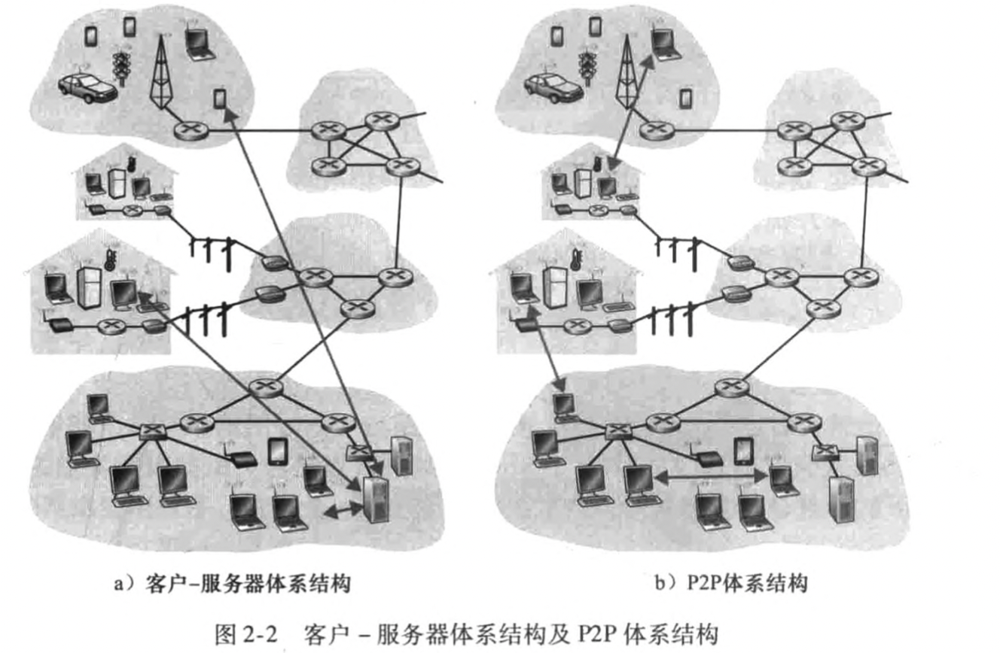

# 应用层

[toc]

## 应用层协议原理

你需要编写将在多台端系统上运行的软件，重要的是，你不需要写在网络核心设备如路由器或链路层交换机上运行的软件，网络核心设备并不在应用层上起作用，而仅在较低层起作用。这种基本设计，即将应用软件限制在端系统的方法，促进了大量的网络应用程序的迅速研发和部署

### 网络应用程序体系结构

应用程序体系结构由应用程序研发者设计，规定如何在各种端系统上组织该应用程序

#### 客户-服务器体系结构

有一个总是打开的主机称为服务器，服务于来自许多其他称为客户的主机的请求。因为该服务器具有固定的、周知的地址，并且因为该服务器总是打开的，客户总是能够通过向该服务器的IP地址发送分组来与其联系

单独一台服务器跟不上它所有客户请求的情况，所以需要大量主机的数据中心来创建强大的虚拟服务器

#### P2P体系结构

对专用服务器有最小的依赖，应用程序在间断连接的主机对之间使用直接通信，这些主机对被称为对等方。常用于家庭、大学和办公室，该体系结构被称为对等方到对等方。P2P体系结构的最引人入胜的特性之一是它们的自扩展性。每个对等方通过向其他对等方分发文件也为系统增加服务能力，P2P体系结构也是有成本效率的，不需要庞大的服务器基础设施和服务器带宽，面临安全性、性能和可靠性等挑战。

### 进程通信

进行通信的实际上是进程而不是程序。在两个不同端系统上的进程，通过跨越计算机网络交换报文而相互通信

#### 客户和服务器进程

网络应用程序由成对的进程组成，这些进程通过网络相互发送报文。对每对通信进程，我们通常将这两个进程之一标识为客户，而另一个进程标识为服务器。

#### 进程与计算机网络之间的接口

多数应用程序是由通信进程对组成，每对中的两个进程互相发送报文。从一个进程向另一个进程发送的报文必须通过下面的网络，进程通过一个称为套接字的软件接口向网络发送报文和从网络接收报文。

套接字是同一台主机内应用层与运输层之间的接口，有于该套接字是建立网络应用程序的可编程接口，因此套接字也称为应用程序和网络之间的应用程序编程接口

#### 进程寻址

为了向特定目的地发送邮政邮件，目的地需要有一个地址，为了标识该接收进程，需要定义两种信息：

1. 主机的地址
2. 在目的主机中指定接收进程的标识符

主机由IP地址标识，接收主机的接收进程由端口号标识

### 可供应用程序使用的运输服务

在发送端的应用程序将报文推进该套接字，在该套接字的另一侧，运输层协议负责从接收进程的套接字得到该报文。当开发一个应用时，必须选择一种可用的运输层协议，能够从四个方面对应用程序服务要求进行分类：可靠数据传输、吞吐量、定时和安全性

#### 可靠数据传输

分组在计算机网络中可能丢失，如：分组能够使路由器中的缓存溢出，或者当分组中的某些比特损坏后可能被丢弃。一个协议提供了这样的确保数据交付服务，就认为提供了可靠数据传输

#### 吞吐量

在沿着一条网络路径上的两个进程之间的通信会话场景中，可用吞吐量就是发送进程能够向接收进程交付比特的速率。具有吞吐量要求的应用程序被称为带宽敏感的应用。带宽敏感的应用具有特定的吞吐量要求，而弹性应用能够根据当时可用的带宽或多或少地利用可供使用的吞吐量。

#### 定时

定时保证，有些服务为了有效性而要求数据交付有严格的时间限制

#### 安全性

在发送传输数据前加密，接收时解密数据

### 因特网提供的运输服务

#### TCP服务

TCP服务模型包括面向连接服务和可靠数据传输服务。

- 面向连接服务：在应用层数据报文开始流动之前，TCP让客户和服务器互相交换运输层控制信息。在握手阶段后，一个TCP连接就在两个进程的套接字之间建立了。这条连接时全双工的，即连接双方的进程可在此连接上同时进行报文收发。
- 可靠的数据传送服务：通信进程能够依靠TCP，无差错、按适当顺序交付所有发送的数据

TCP协议还具有拥塞控制机制，能为因特网带来整体好处，在网络出现拥塞时，会抑制发送进程。还视图限制每个TCP连接，使它们达到公平共享网络带宽的目的。

TCP没有提供任何加密机制，TCP加强版本SSL层在应用层实现，提供了安全性服务

#### UDP服务

1. UDP不提供不必要服务的轻量级运输协议，它仅提供最小服务
2. UDP是无连接的，因此进程通信前没有握手过程
3. UDP提供一种不可靠数据传送服务

#### 因特网运输协议所不提供的服务

今天的因特网通常能够为时间敏感应用提供满意的服务，但它不能提供任何定时或带宽保证

### 应用层协议

应用层协议定义了运行在不同端系统上的应用程序进程如何相互传递报文。

- 交换的报文类型，例如请求报文和响应报文
- 各种报文类型的语法，如报文中的各个字段及这些字段时如何描述的
- 字段的语义，即这些字段中的信息的含义
- 确定一个进程何时以及如何发送报文，对报文进行响应的规则

有些应用层协议是由RFC文档定义的，因为此位于公共域中，有些不是

## Web和HTTP

### HTTP概况

Web的应用层协议是超文本传输协议，它是Web的核心。Web页面是由对象组成的。一个对象只是一个文件，诸如一个HTML文件，一个JPEG图形等。web服务器实现了HTTP的服务器端，它用于存储Web对象，每个对象由URL寻址。

#### 非持续连接和持续接连

非持续性连接：每个请求/响应对使经一个单独的TCP连接发送

持续性性连接：所有的请求及其响应经相同的TCP连接发送

#### HTTP报文格式

HTTP请求报文的第一行叫作请求行(request line),其后继的行叫作首部行(header line)o请求行有3个字段:方法字段、URL字段和HTTP版本字段。

首部行 Host：xxx指明了对象所在的主机，是Web代理高速缓存所要求的。

Connection：close首部行，告诉服务器不要麻烦地使用持续连接

#### HTTP响应报文

它有三个部分:一个初始状态行(status line) , 6个 首部行(header line), 然后是实体体 (entity body)

### 用户与服务器的交互：cookie

HTTP服务器时无状态的，然而一个Web站点通常希望能够识别用户，可能是因为服务器希望限制用户的访问，或因为它希望把内容与用户身份联系起来。

1. 在HTTP响应报文中的一个cookie首部行
2. 在HTTP请求报文中的一个cookie首部行
3. 在用户端系统中保留有一个cookie文件，并由用户的浏览器进行管理
4. 位于Web站点的一个后端数据库

### Web缓存

Web缓存器也叫代理服务器，它是能够代表初始Web服务器来满足HTTP请求的网络实体。Web缓存器有自己的磁盘存储空间，并在存储空间中保存最近请求过的对象的副本

案例：

一台路由器与因特网上的一台路由器通过一条15Mbps的链路连接，对象平均长度为1Mb，平均访问速率为15个请求，局域网为100Mbps，因特网时延2s

局域网流量强度：1 * 15 / 100 = 0.15

接入链路流量强度：1 * 15 / 15 = 1

解决接入链路延迟高问题：

1. 增加接入链路的速率：15Mbps -> 100Mbps 

   2.01

2. 安装web缓存器，假设命中率为0.4

   流量强度：1 * 15 * 0.6 / 100 = 0.6 时延约几十毫秒

   0.4 * 0.01 + 0.6 * 2.01 > 1.2

### 条件GET方法

允许缓存器正式它的对象是最新的，这种机制就是条件GET方法。

1. 一个代理缓存器代表一个请求浏览器，向某web服务器发送一个请求报文
2. 该Web服务器向缓存器发送具有被请求的对象的响应报文
3. 该缓存器在将对象转发到请求的浏览器的同时i，本地缓存了该对象，也存储了最后修改日期
4. 之后用户请求同一个对象，缓存器待着If-Modified-Since这个首部行，发送给服务器。没有修改，服务器就发送304

### 因特网中的电子邮件

三个主要部分：

1. 用户代理
2. 邮件服务器
3. 简单邮件传输协议

SMTP是因特网电子邮件中主要的应用层协议，使用TCP可靠数据传输服务。SMTP有两个部分：运行在发送方邮件服务器的客户端和运行在接收方邮件服务器的服务器端，每台邮件服务器上既运行SMTP的客户端也运行SMTP的服务器端

#### SMTP

限制所有邮件报文的体部分只能采用简单的7比特ASCII表示。在用SMTP传送邮件之前，需要将二进制多媒体数据编码为ASCII码，并且在使用SMTP传输后要求将相应的ASCII码邮件解码还原为多媒体数据

例子：

假设Alice想给Bob发送一封简单的ASCII报文

1. Alice调用她的邮件代理程序，指示用户代理发送报文
2. Alice的用户代理把报文发给她的邮件服务器，在哪里该报文被放在报文队列中
3. 运行在Alice的邮件服务器上的SMTP客户端发现了报文队列中的这个报文，创建一个到运行在Bob的邮件服务器上的SMTP服务器的TCP链接
4. 在经过一些初始SMTP握手后，SMTP客户通过该TCP🔗发送Alice报文
5. 在Bob的邮件服务器上，SMTP的服务端接收该报文，邮件服务器将该报文放入Bob的邮箱中
6. Bob方便的时候，调用用户代理阅读该报文

现象：

1. SMTP一般不使用中间邮件服务器发送邮件，会直接在在两个服务上建立TCP连接

### 与HTTP的对比

1. HTTP主要是一个拉协议，SMTP基本是一个推协议
2. SMTP要求每个报文采用7比特ASCII码格式
3. 如何处理一个既包含文本又包含图形的文档，HTTP把每个对象封装到它自己的HTTP响应报文汇总，而SMTP则把所有报文对象放在一个报文之中

### 邮件报文格式

From: alice@crepes・fr
 To: bob@hamburger・edu
 Subject: Searching for the meaning of life・

### 邮件访问协议

使用如POP3这样的邮件访问协议来讲邮件从接收方的邮件服务器传送到接收方的用户代理

#### POP3

一个极为简单的邮件访问协议，当用户代理打开了一个到邮件服务器端口110上的TCP连接后，POP3就开始工作了，随着TCp连接，POP3按照三个阶段进行工作：特许、事务处理以及更新

1. 用户代理发送用户名和口令以鉴别用户
2. 用户代理取回报文；同时在这个阶段用户代理还能进行如下操作，对报文做删除标记，取消报文删除标记，以及获取邮件的统计信息
3. 更新阶段，出现在客户发出了quit命令之后，目的是结束该POP3会话，这时，该邮件服务器删除那些被标记为删除的报文

#### IMAP

1. 服务器把每个报文与一个文件夹联系起来，能移到一个新的、用户创建的文件夹中，阅读邮件，删除邮件等，在远程文件夹中查询邮件的命令，按指定条件去查询匹配的邮件
2. 允许用户代理获取报文某些部分的命令

#### 基于Web的电子邮件

使用浏览器和邮箱服务器通信，使用http协议，邮箱之间扔使用SMTP

